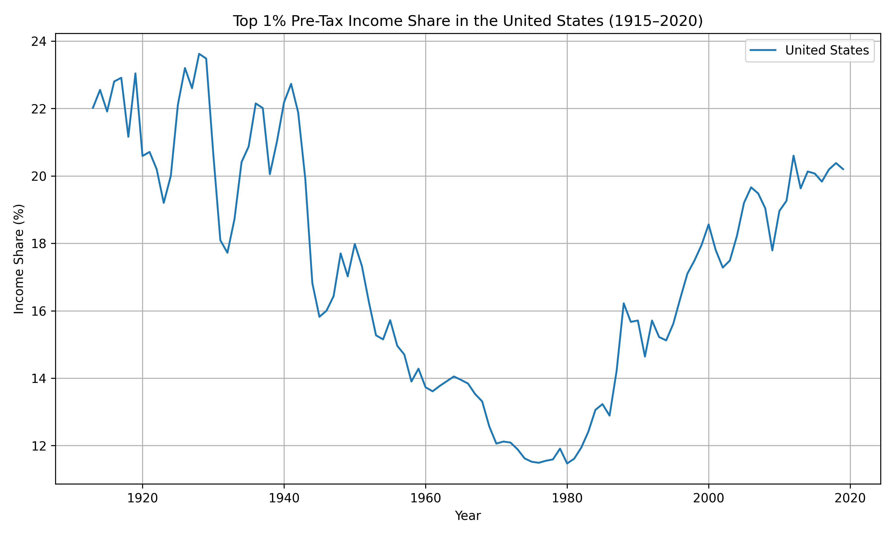

# World Inequality Database ETL and Analysis Project

## Overview

This project provides an end-to-end pipeline for working with the World Inequality Database (WID.world) data. It includes scripts for extracting, transforming, and loading (ETL) the data into a structured SQLite database. The database enables advanced data analysis and can be extended to serve via a REST API.

## Contents

```
.
├── data/                  # Raw/unprocessed data (csv) downloaded from WID
├── demo/                  # Demo database and scripts
│   ├── demo.db
│   ├── export_demo_db.py
├── etl/                   # ETL scripts for CSV to SQLite
│   ├── load_metadata.py
│   ├── load_countries.py
│   └── load_data.py
├── output/                # Generated plots and images
├── src/                   # Analysis or API scripts
├── wid_world.db           # SQLite database
├── README.md              # Project documentation
```

## Data Source

All data files used in this project are sourced from the official World Inequality Database: [**https://wid.world/data/**](https://wid.world/data/)

This includes:

- `WID_data_XX.csv` files (raw income/wealth data for each country or region)
- `WID_metadata_XX.csv` files (metadata describing each variable)
- `WID_countries.csv` (lookup table for country and region codes)

## Data Format

CSV files are semicolon (`;`) delimited.

- `WID_data_XX.csv` includes:
  - `country`, `variable`, `percentile`, `year`, `value`, `age`, `pop`
- `WID_metadata_XX.csv` includes:
  - Country, variable, age/pop breakdowns, descriptions, source, units
- `WID_countries.csv` includes:
  - 2-letter code, name, region classification

## ETL Pipeline

### 1. `load_metadata.py`

Parses and loads all available `WID_metadata_XX.csv` files into a `metadata` table.

### 2. `load_data.py`

Parses and loads all `WID_data_XX.csv` files into a `data` table.

### 3. `load_countries.py`

Loads the `WID_countries.csv` file into a `countries` table.

Each script connects to a single SQLite database (`wid_world.db`) and appends its relevant dataset.

## Database Schema

``** table:**

- `country`, `variable`, `age`, `pop`, `countryname`, `shortname`, `simpledes`, `technicaldes`, `shorttype`, `longtype`, `shortpop`, `longpop`, `shortage`, `longage`, `unit`, `source`, `method`

``** table:**

- `country`, `variable`, `percentile`, `year`, `value`, `age`, `pop`

``** table:**

- `alpha2`, `titlename`, `shortname`, `region`, `region2`

## Sample Analysis Output

One example output of this project is a historical chart of top 1% income share in the United States:



This was created using the variable `sptinc992` (pre-tax income share for adults, equal-split) and filtered for `p99p100` percentiles.

## Demo

This repo includes a lightweight SQLite demo database (~75MB) in `demo/demo.db` with selected variables and countries (FR, US, IT, GB,MX) from 1980 onward, intended for fast prototyping and public API demos.

## License

This project uses data made available by the World Inequality Lab. Refer to [https://wid.world](https://wid.world) for licensing and usage terms.

